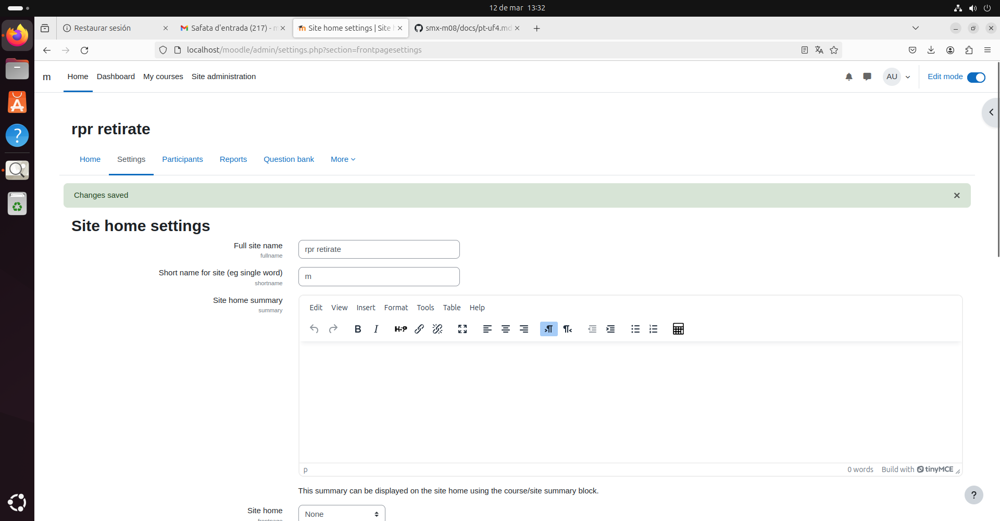

# moodle

como cambiar el site home

para configurarlo tiene que ir administración de sitio y buscar site home y hay podeis cambiar el nombre y la descripción 

esta es mi lista de alumno y clases

yo tengo 10 alumnos y dos clase una llamada ofimática y otra equipo de football va todos a la misma clase en ofimatica tiene una actividad puesta

matricular a un alumno y lista de alumno

aqui es donde matriculo a los alumnos y asi tiene su moodle y su clase y tambien que vean la lista de compañeros

aparecía de mi moodle

aqui explicare lo que puse en mi moddle 

una vez que entren a moodle le va salir un logo en iniciar sesión y así no esta tan aburrido y tambien puse un calendario 

esto fueron los comandos que use para crear moodle

